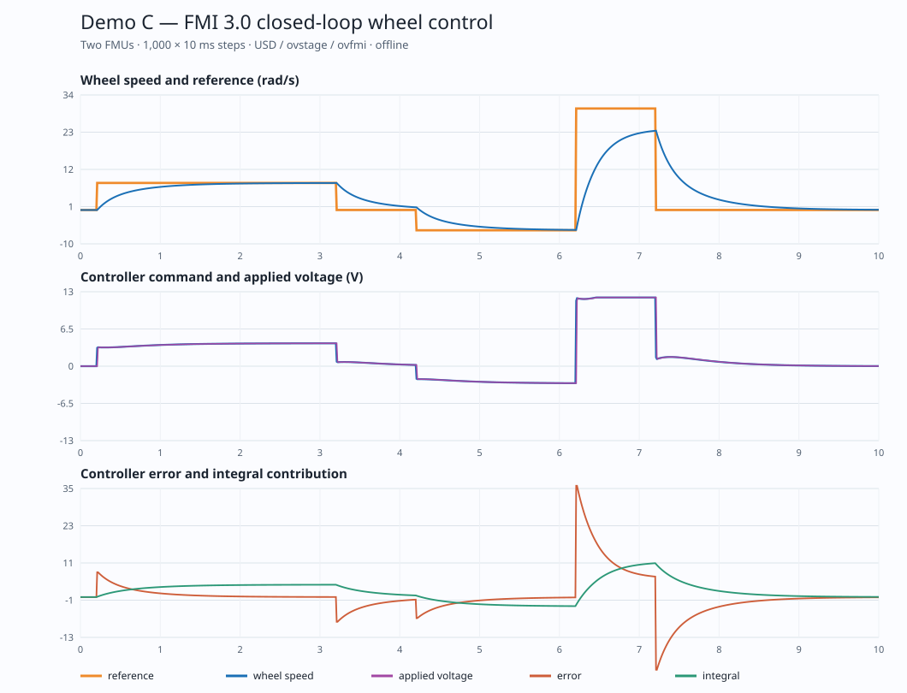

# Demo C — two-FMU closed-loop wheel control through OpenUSD and ovfmi

Demo C is a completed, **offline** FMI 3.0 Co-Simulation experiment. An openSeRo PI-controller FMU and an openSeRo first-order wheel-plant FMU are instantiated as separate `FmuInstance` prims in [one USD stage](../scenes/demo_C_closed_loop.usda). The [runner](../scripts/run_demo_c.py) exchanges their signals through ovstage/ovfmi at 10 ms intervals, checks every published output against direct FMPy orchestration and an analytic recurrence, and records the result. No ROS topic, Jetson, motor, or physical robot is connected.



## Evidence at a glance

| Recorded observation | Result |
|---|---:|
| FMU files / instances | 2 / 2 |
| Successful communication steps | 1,000 × 0.01 s |
| Maximum ovstage-publication vs ovfmi-output difference | `0` |
| Maximum ovfmi vs direct FMPy difference over all six output signals | `1.9025629498514718e-6` |
| Maximum direct FMPy vs independent analytic recurrence difference | `0` |
| Repeated ovfmi run in the tested environment | identical trace |
| Maximum controller command magnitude | `12 V` |
| Time saturated during the +30 rad/s profile section | `0.75 s` |
| Measured 2%-band settling time after the +8 rad/s step | `1.88 s` |

The full per-signal differences, segment metrics, exact FMU and scene hashes, and limitations are in the [JSON report](../results/demo_C/report.json); all 1,001 time points (initial state plus 1,000 steps) are in the [CSV](../results/demo_C/trace.csv). The comparison threshold is `5e-5`, declared in the runner. It is intentionally larger than the measured maximum because ovfmi 0.2 publishes ordinary stage signals as float32 while direct FMPy reads the FMU's Float64 values. This is numerical agreement, not a latency/throughput benchmark or proof of physical control quality.

## What is actually connected

The [controller FMU](../fmus/MolonbotWheelPIController.fmu) receives `omega_ref_rad_s` and `omega_meas_rad_s`; it publishes `voltage_cmd_V`, `error_rad_s`, and `integral_V`. The previously published [plant FMU](../fmus/MolonbotWheelPlant.fmu) receives `voltage_cmd_V`; it publishes `voltage_applied_V`, `omega_rad_s`, and `theta_rad`. The controller implements the exact discrete PI with back-calculation anti-windup specified in the [export contract](DEMO_C_FMU_SPEC.md). At 8 rad/s from the initial zero state, its first direct-FMPy step returns `(3.2 V, 8 rad/s, 0.096 V)` for command, error, and integral contribution.

At step `k`, the host writes the current reference, the plant speed published after step `k-1`, and the controller voltage published after step `k-1` into separate USD state prims. It then calls `update_from_ovstage()`, `step_sync(0.01)`, and `write_to_ovstage()` and reads all six outputs. The delay is deliberate: both FMUs advance together without an implicit algebraic loop. The profile starts with 0 rad/s for 0.2 s, then +8 for 3 s, 0 for 1 s, −6 for 2 s, +30 for 1 s, and 0 until 10 s. The initial zero interval also avoids the [observed ovfmi 0.2 first-step input edge case](../results/first_step_probe.json); it does not claim that edge case is solved.

The runner verifies command bounds, finite outputs, published error arithmetic, plant input equal to the prior command, output mapping/order, FMU hashes, and repeatability. A separate [USD/FMU mapping preflight](../scripts/validate_demo_c_scene.py) checks both FMU assets, state targets, variable names, directions, and zero start values before each run. The [regression tests](../tests/test_demo_c.py) additionally check FMU metadata, the exact first-step result, and negative cases for NaN input, invalid parameter, unsupported 20 ms step, wrong variable name, disconnected target, wrong USD start value, and missing FMU. The source ZIP's author-provided acceptance script was also run locally and passed its 2,000-step random-input checks, non-default parameter tests, and four-controller/four-plant extension; the public repository's independent evidence is the executable code, CSV, and JSON above. We have **not** tested a physical wheel or a closed-loop four-wheel robot with ovfmi here.

## Isaac Sim visualization

The [10-second MP4](../results/demo_C/demo_C_closed_loop.mp4) and [timeline-playable USD](../scenes/demo_C_wheel_visual.usda) show the published wheel angle on an indicator, with orange reference and blue measured-speed bars. The [visual builder](../scripts/build_demo_c_visual.py) bakes the verified CSV into 1,001 USD time samples; [Isaac Sim rendered](../scripts/render_demo_c_isaac.py) 61 frames at 960×540/6 fps, and the [encoder](../scripts/encode_demo_c.py) added English signal labels. The [render manifest](../results/demo_C/render_manifest.json) and [video metadata](../results/demo_C/video_metadata.json) bind the video to exact scene/trace hashes. This is a signal visualization of an offline trace, **not** a PhysX motor, contact, or real-time co-simulation demonstration.

## Authorship: openSeRo model and bench

The controller FMU was created in the author's SeRo_MBE/openSeRo tool. These eight author-provided screenshots are included unchanged under MIT; the [SHA-256 list](../assets/opensero/controller_screenshots/SHA256SUMS) verifies the copies. The original private ZIP, editable project JSON, export log, and author-generated bench results are not published. In particular, the screenshots document the modeling workflow; they are not the independent ovfmi/FMPy validation.

1. [Controller block model](../assets/opensero/controller_screenshots/01_controller_model.png): two speed inputs, four PI/anti-windup parameters, three outputs.
2. [PI and back-calculation code](../assets/opensero/controller_screenshots/02_pi_antiwindup_code.png): pre-update integral ordering and clamped command.
3. [Voltage-limit parameter](../assets/opensero/controller_screenshots/03_parameter_voltage_limit_range.png): positive range and 12 V default.
4. [Exact initial controller output](../assets/opensero/controller_screenshots/04_output_voltage_cmd_initial_exact.png): zero start value.
5. [FMI 3.0 fixed-step export dialog](../assets/opensero/controller_screenshots/05_export_dialog_fixed_step.png): Co-Simulation, 10 ms, Linux and Windows x64.
6. [In-tool closed-loop bench](../assets/opensero/controller_screenshots/06_closed_loop_bench.png): controller FMU, plant FMU, and native reference path.
7. [In-tool bench results](../assets/opensero/controller_screenshots/07_bench_results.png): speed, voltage, and integral overlays.
8. [Speed/reference detail](../assets/opensero/controller_screenshots/08_speed_reference_FMU_vs_MIL.png): visible step profile and response.

## Reproduce

On Linux x86-64 with Python 3.10, install [the pinned dependencies](../requirements.lock), then run:

```bash
.venv/bin/python scripts/run_demo_c.py
.venv/bin/python scripts/validate_demo_c_scene.py
.venv/bin/python scripts/plot_demo_c.py
.venv/bin/python scripts/build_demo_c_visual.py
.venv/bin/python -m unittest tests.test_demo_c -v
```

Isaac Sim 6.0.1 is needed only to regenerate the MP4, not to run the numerical validation:

```bash
/path/to/isaacsim/python.sh scripts/render_demo_c_isaac.py
python3 scripts/encode_demo_c.py
```

The last command needs OpenCV on the system Python. The pinned numerical environment does not require OpenCV. All files in this repository use relative USD dependencies; the physical-robot software and private Molonbot asset snapshots remain separate.
