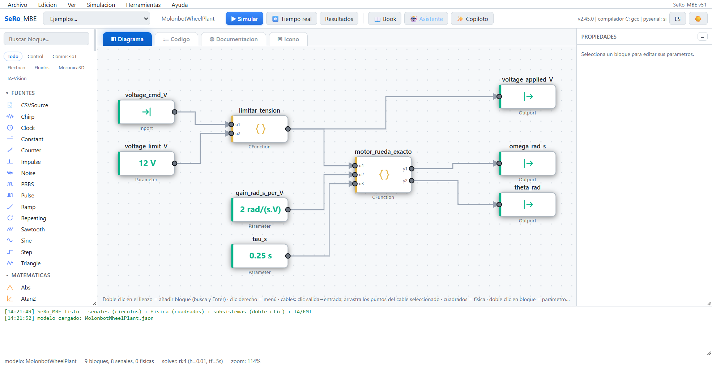
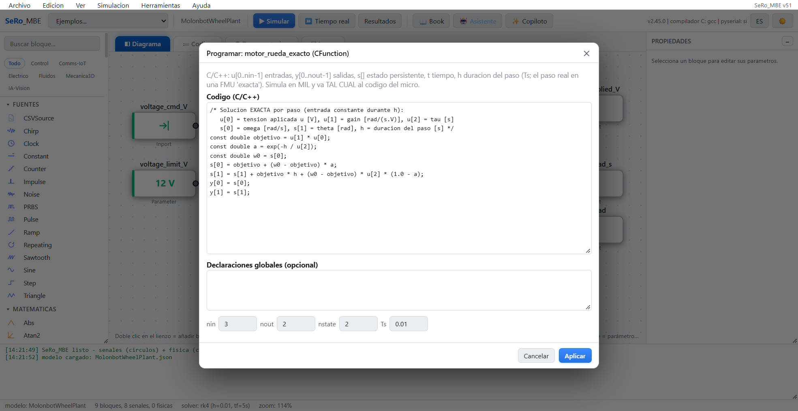
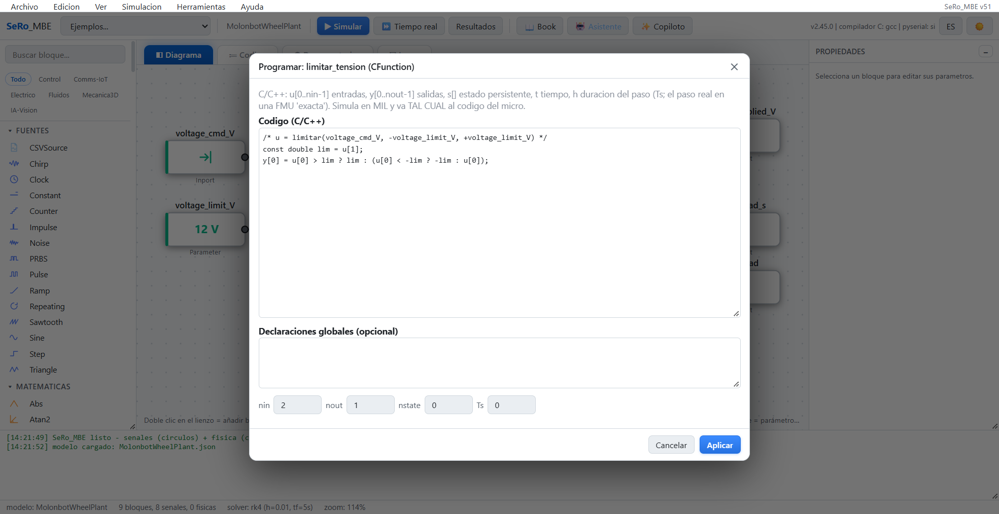
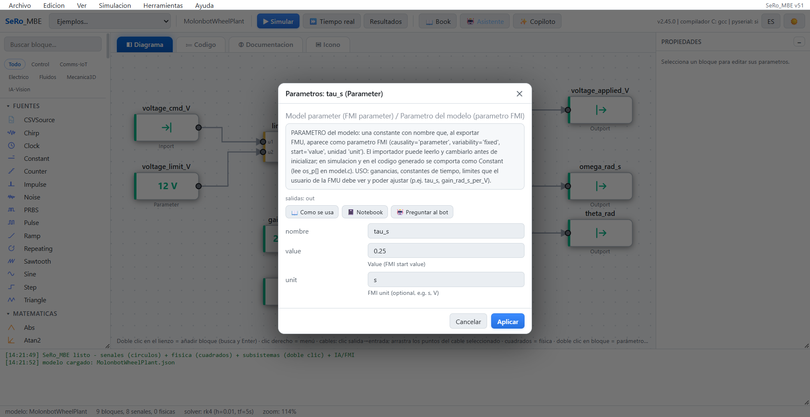
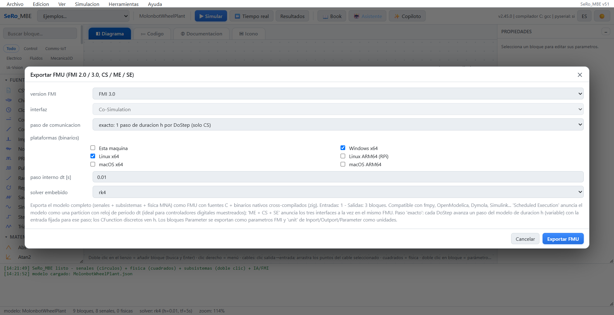
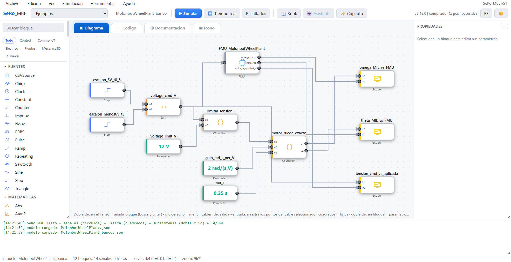
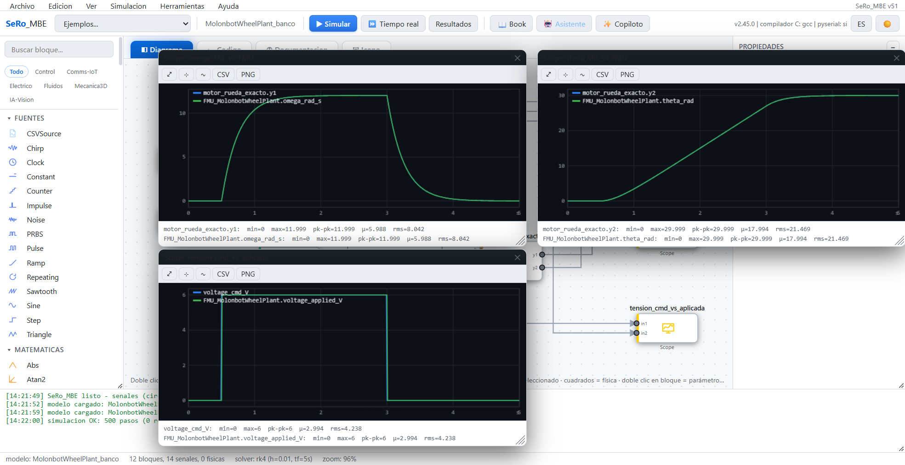
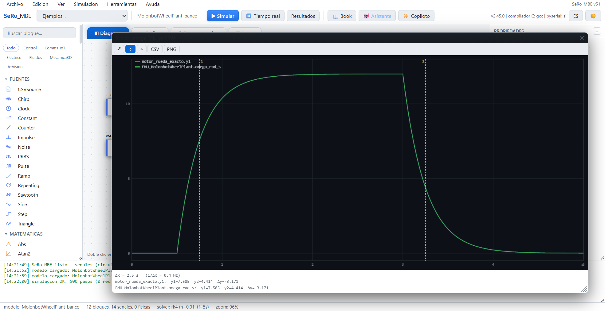

# Wheel-plant modeling in openSeRo / SeRo_MBE

These eight original screenshots were provided by the author in the `MolonbotWheelPlant.zip` archive and published here with the author's permission under the repository's [MIT License](../LICENSE). They show the author-owned SeRo_MBE/openSeRo interface used to build and export the included FMI 3.0 Co-Simulation wheel-plant FMU. The images are preserved unchanged; [SHA-256 values](../assets/opensero/screenshots/SHA256SUMS) let readers verify the copies. The private archive and editable modeling projects are not part of this public repository. See [FMU provenance](../FMU_NOTICE.md) for the matching archive and FMU hashes.

The screenshots explain the *modeling process*. They do not establish calibrated motor physics, real-robot performance, or independent numerical agreement. The [Demo A report](../results/demo_A/validation/report.json) and [four-wheel report](../results/drive/report.json) contain the separate, reproducible ovfmi-versus-FMPy checks.

## 1. Wheel-plant block model

The input voltage passes through a saturation block; the model then generates angular speed and angle using the declared gain and time constant.

## 2. Per-step motor response code

The model's C function implements the exact first-order response for a held input over one communication step and integrates wheel angle.

## 3. Voltage saturation code

The separate limiter clamps the signed voltage to the configured magnitude before the wheel-response function.

## 4. Time-constant parameter

The screenshot records `tau_s = 0.25 s` as an FMI model parameter in the author's tool.

## 5. FMI 3.0 Co-Simulation export

The export dialog shows FMI 3.0 Co-Simulation, a 0.01 s step, and Linux/Windows x64 binaries selected. The actual FMU metadata and binaries are also checked by the repository's automated tests.

## 6. In-tool comparison bench

The bench connects the same voltage profile to a native model path and to the exported FMU, with scopes for speed, angle, and applied voltage.

## 7. In-tool response plots

The speed, angle, and voltage traces are visually overlaid in the author's bench. This is useful context, not a substitute for the per-sample exported-FMU comparisons in the public CSV and JSON reports.

## 8. Speed response cursors

The in-tool speed plot shows two cursor checkpoints near 0.75 s and 3.25 s. The repository's direct FMPy check records the numerical values separately.

